# Weld Spot - Detecting Defects in Welding

Welding consists in joining metal parts together by melting and cooling them. The process involves heat, chemicals and other materials.
The quality of the welding may vary depending on several factors, like the positions, quantity and quality of the materials, pressure, heat, and so on. Defects that welding may result in include cracks, porosity (e.g., air bubbles), tearing, etc.

To ensure adequate quality of the welding, it is important to test the welding (e.g., by applying weight).
Visual inspection is a prior way to detect common defects.
Weldings made by human and machines can be visually checked in search of such defects.
However, when there are a lot of welding points to check in a structure, a human watcher could overlook or misjudge some.

Having an AI-tool to aid during that step can mitigate some of the human errors and prevent failures in the welding to become a major inconvenience.
This project proposes the use of computer vision to automate the visual inspection of weldings, reducing time, costs and failures.

The application of AI requires a lot of components that should communicate well. So, applying MLOps practices will be important for the success of the project.

---

# Table of Contents
- [Objective](#Objective)
- [Structure](#Structure)
  - [Data](#Data)
  - [Modeling](#Modeling)
  - [Cloud](#Cloud)
    - [Containers](#Containers)
  - [Client](#Client)
- [Installation](#Installation)

---

# Objective

The goal of this project is to create a minimum viable product (MVP) that allows clients to check the quality of welding with their smartphone cameras.

The MLOps Lifecycle presented in this repository should be a starting point to achieve this goal.

###### NOTE: There are a lot of types of welding, which include different approaches based on the metals, applications, environments, techniques, and so on. This project only focuses on visual detection in generic welding for basic use cases to make it simple to develop our MLOps project.

# Structure

The following is a diagram that shows how the project is built.
This involves all required parts like client app, data, cloud deployment, etc. This project is centered in MLOps as part of the Zoomcamp 2024 course, although DevOps (CI/CD) is also integrated.

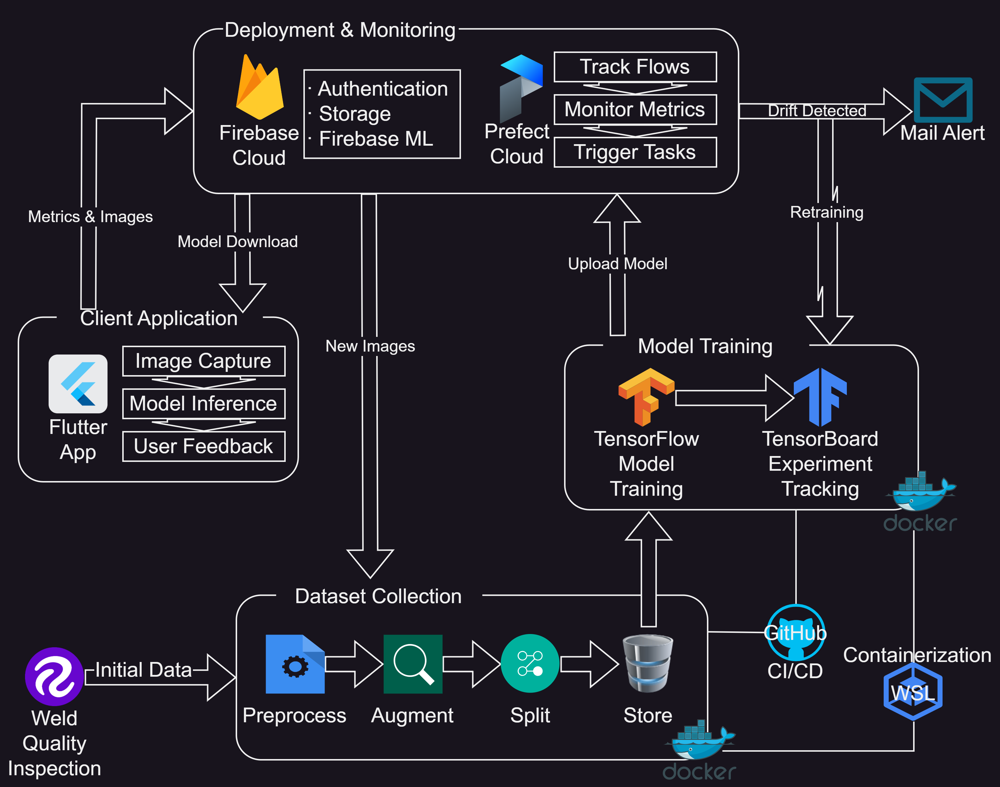

This project is divided into three main components: The modeling service, the cloud and the client app.

Following sections overview the technologies employed. You can skip to the [Installation](#Installation) section for instructions on how to configure everything (including the creation of cloud accounts).

The base structure of the project contains the following:

```
WeldSpot/
├─README.md: The document you are reading now. Please, follow the instructions carefully.
├─.pre-commit-config.yaml: The pre-commit hooks.
├─Makefile: The make scripts for settings most of the things in this project.
├─modeling/: The data prepration and model training and deployment. Contents explained later.
├─client/: The client flutter app, explained later.
├─images/: Images used by the readme.
├─.env: File will be created after following instructions. Used to pass environment variables through the scripts.
├─google-services.json: File will be created after following instructions. Settings configured in the cloud.
└─serviceAdmin.json: File will be created after following instructions. Admin keys for managing the cloud.
```

## Data
As it can be observed in the illustration, data for model training comes from two sources:

* [Roboflow - Weld Quality Inspection dataset](https://universe.roboflow.com/welding-2bplp/weld-quality-inspection-rei9l/dataset/9) was found, which offers a staring point to train ML models.
* User feedback to measure drift and retrain with their provided images. ** THE IMAGES ARE NOT ANONYMIZED OR CENSORED: INTENDED FOR PRIVATE USE**.

When training the models, data is divided in 3 folders, namely "train" for ML training epochs, "valid" for ML validation epochs, and "test" for testing and evaluation.
Each of these folders, at the same time, contains subfolders for each of the possible classes identified: Background (no welding present), Bad Welding, Crack, Excess Reinforcement, Good Welding, Porosity, and Splatters.

The Weld Quality Inspection dataset does not contain "background" images (which may help improve our model learning performance). So I curated a set of random unrelated images for the initial dataset from public sources (included in the `modeling/data/initial.zip` file). You don't need to extract the files, as this is automated.

## Modeling
The two processes that communicate with the cloud deployment are developed inside the `modeling` folder: **Dataset Collection** process and **Model Training** process, with the following structure:

```
modeling/
├──.env: Automatically coppied from the base directory .env, so the docker deployed image has the environment variables you've set.
├──requirements.txt: Python code dependencies.
├──Makefile: Automation of development processes.
├──Dockerfile: For containerizing the modeling project.
├──options.py: Loads setting variables and files for the python code.
├──app.py: Entry point to execute the modeling service.
├──tests/: Where pytest unit tests are stored.
├──private/: Where private data (e.g., cloud authentication keys) are copied.
├──flows/: Orchestration workflows using prefect.
|  ├──register_flows.py: For registering all the prefect flows with the cloud service.
|  ├──collection_pipeline.py: For the Dataset Collection and Analysis pipeline.
|  └──training_pipeline.py: For the Model Training and Evaluation pipeline.
├──data/: Where datasets are stored.
|  ├──initial/: Where the initial (Roboflow) dataset is stored.
|  ├──raw:/ Where images corrected by users are stored for future trainings.
|  ├──procesed/: Where the preprocessing tasks stores the images.
|  ├──augmented/: Where augmented images are stored after the preprocess.
|  ├──splits/: Where the final, splitted (train, valid, test) versions are stored for training.
|  └──initial.zip: Background class initial data to use with roboflow dataset.
├──logs/: Where TensorBoard tracking will be stored at.
├──models/: Where models are stored.
|  ├──best:/ Last models kept for future retraining. Models saved in Keras format.
|  └──deploy/: For models deployed to the cloud. Models saved in Tensorflow Lite format.
└──service/: Where the rest of the python code is located (employed by the pipelines mostly).
```

###### NOTE: Some of the paths may be missing and are created when following the [installation instructions](#Installation).

An already pretrained model is provided (`models/best/welding_0.pb`) to save time with the first training, which may be slow with low-spec machines. More info on how the models are managed is provided later.

## Cloud

Two cloud services are employed:

* [Firebase](https://firebase.google.com/) from google, is like GCP but more focused to smartphone apps. Offers a _Spark Plan_ with limited free services.
* [Prefect 2](https://docs.prefect.io/latest/) cloud account is free too with enough limited resources for testing the project. We can run the pipeline in a container and monitor it from the cloud.

Instructions on how to create accounts and configure them are provided in the [Installation](#Installation) section.

### Containers

The data collection and model training are built to run on docker container and tested with Ubuntu image.
Because I am using a Windows machine, I installed [Docker Desktop](https://www.docker.com/products/docker-desktop/) and configured it to use [Windows Subsystem for Linux (WSL)](https://learn.microsoft.com/windows/wsl/install). Only installing [Docker](https://docs.docker.com/engine/install/) in your system or deploying to cloud should also work.

Instructions on how to generate the docker image are provided in the [Installation](#Installation) section.

Additionally, if using WSL, for allowing NVIDIA GPU in model training, the Windows machine should have updated [NVIDIA Drivers](https://www.nvidia.com/Download/index.aspx) installed. This is optional if no NVIDIA GPU is available, but will increase the training speed. Installation scripts (e.g., Makefile) already automate most of the installation required, you only need to ensure latest NVIDIA drivers in case. If you run `nvidia-smi` command on terminal and see your GPU available, it means you can run tensorflow with GPU, if it gives error tensorflow (for training the models) will run with the CPU.

## Client
I adapted an app based in an [example of TFLite plugin for flutter](https://github.com/tensorflow/flutter-tflite/tree/main/example/image_classification_mobilenet).
I have already built it for android and include the APK to check how it works (although it connects to my cloud). The project can also be built for iOS, but I haven't tested.

The retraining can be manually triggered from the cloud without the need of the app, but for testing how the app downloads the deployed model and uploads corrected pictures, you may want to configure the client app and build it. Instructions on how to use and configure the app to work with your Firebase account are provided later.

# Installation

It is recommended to use a clean installation of linux (or WSL, or a docker container), preferably Ubuntu 22.04+,
as the setup script installs several packages, including specific android sdk version. I used Ubuntu 24.04 with Python 3.12.
If conflicts arise, you may check the Makefile `setup` and `dependencies_` scripts (more info on this later) for troubleshooting or try to clean your system (I take no responsibility if your machine breaks, sorry).

## Accounts setting

All of the 3 services we are going to create an account with allow to use google and similar accounts to avoid having to create accounts with mail and password. So you may consider that. The accounts are also easy to create (the classic register-login and you're in) and don't require inputting private info like credit cards (we are going to use free tiers with limited features).

### Roboflow

From Roboflow we only require an API key so they allow us to download datasets from python code.

1. Access [Robofow](https://app.roboflow.com/) and sign-in.
2. Browse to the [Weld quality inspection Dataset](https://universe.roboflow.com/welding-2bplp/weld-quality-inspection-rei9l/dataset/9) we are going to use.
3. In the upper right corner, click on **Download Dataset**, select _Pascal VOC_ format, _show download code_ option and click _Continue_.

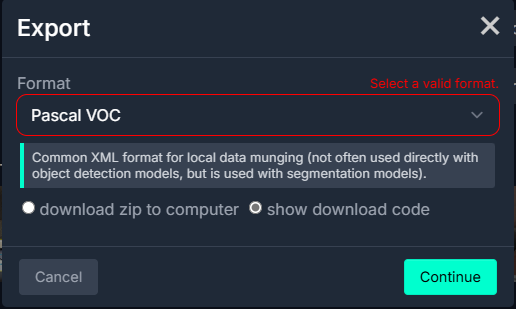

4. It will show a snippet with hidden text as in the following image. Make sure you copy the entire api key, will look something like _z00ABC31FJd94OXX3b94_.

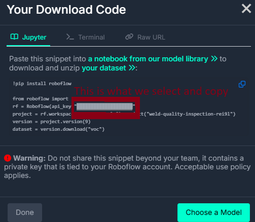

5. The rest of the script is already configured in the project, we only need to copy that hidden text by selecting it normally and pasting it. **Copy it to a text note as we will use it later**.

### [Prefect 2](https://docs.prefect.io/latest/).

1. Access [Prefect Cloud](https://app.prefect.cloud/) and sign-in.
2. Configure your account if you haven't yet, with a name that hasn't been used by other users.


3. If presented with any _Get Started_ step, we will skip for now by pressing **Next** and **Skip this step**. (We don't create any flow yet).

4. In the upper left side of your prefect dashboard you'll see a "default" option. Click on it, and then in _API Keys_.

5. **Create API Key +**, pick a _Name_ and _Expiration Date_.

6. Copy the key, will look something similar like "pnu_aBBcDeFFgH1J23KKllMMnnnn4OOppp5qqqqR".

7. Similar to the Roboflow key, **copy it to a text note as we will use it later**. Don't lose the key, because it won't be printed again and you'll have to create another.

8. Now, we go back to the prefect dashboard (exit _Settings_).

#### Automation

Here we are going to send an alert when there is drift. So, besides retraining (already programmed in the project), we can receive an email notifying when drift occurs.

1. Click on the **Automation** from the left side of the menu.

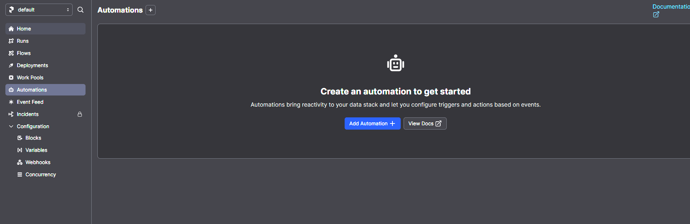

2. First, we need the trigger (the event that causes the automation to start). We select **Custom** as the type, and write "**drift.detected**" as the matching event and "**dataset.auc**" as the resource. This is the event name I've set in the project code. It may not appear listed in prefect cloud search as you type, but that is not a problem. Configuration should look like following image. Set 1 time within 1 minute for demostration purposes (every time we have a drift, we receive a mail).

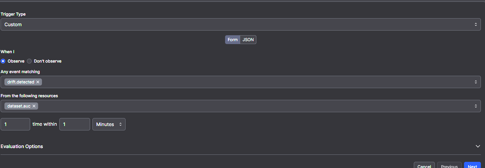

3. Click Next, and as **Action Type** we pick _Send a notification_  (you may need to scroll down on the dropdown selector). We can leave the default content. Now we click on the **Block** option to fill it.

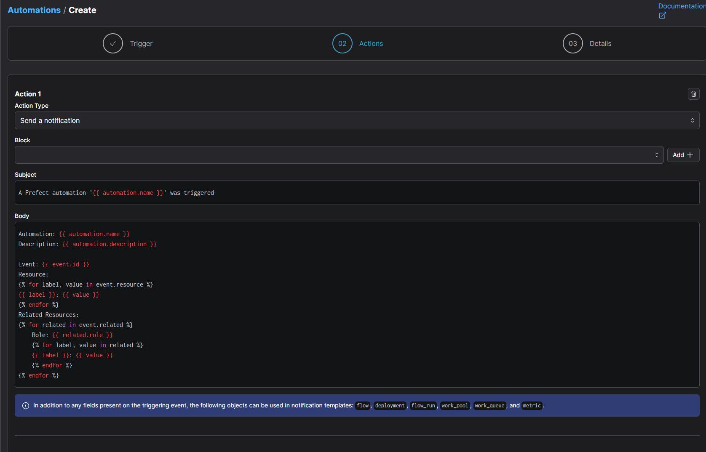

4. In the **Block** option we have to input the mail (or mails) address that receive the notification alert. Use the "**Add +**" option and select _Email_.

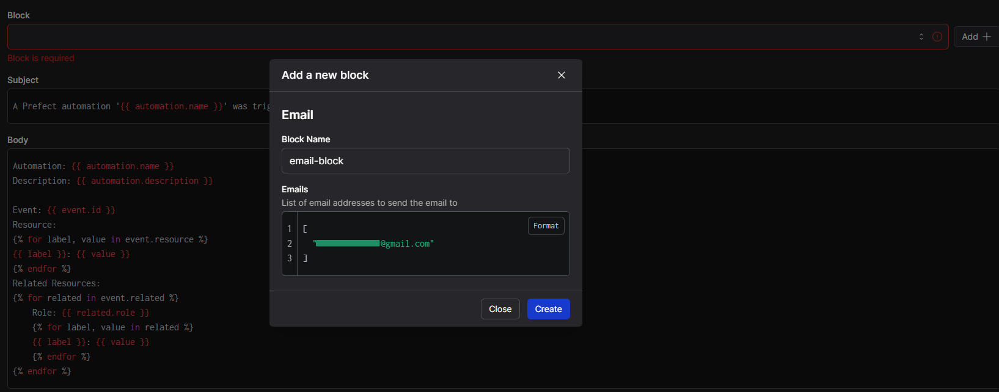

5. We set the block with your e-mail as in the picture and confirm. Save your automation and you're done.

### [Firebase](https://firebase.google.com/).

1. Sign-in into [Firebase Console](https://console.firebase.google.com/u/0/) and create a project with "Start with Firebase Project" option. (We **don't** need credit card information).

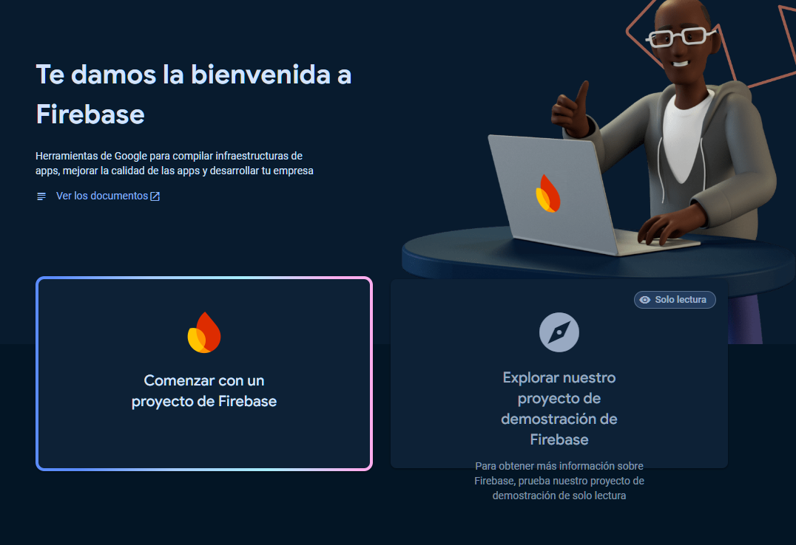

2. Project names use a unique identifier (not already taken). Accept terms and proceed.

3. We don't need to use Google Analytics for our project. Create Project and wait for resources to be provided.

#### Features

We now have to setup a series of features so the firebase project works with our project.

##### Flutter (Firebase)

Flutter is an SDK maintained by Google that uses the Dart programming language (don't worry, the app is already programed, you don't need to know) for developing cross-platform apps. So, with a single code base we can deploy an app to iOS, Android, Web, Windows, Linux, etc. It also integrates well with Firebase and with Tensorflow Lite (ML model format). Android emulators can be used to test the app, but running the ML model will be better in a real device (you may want to enable developer mode on your device for debuging the android app if you are interested).

In the Firebase Console, after selecting the project, we will see a Get Started with your app. We are going to set the Flutter app, because we are using flutter.

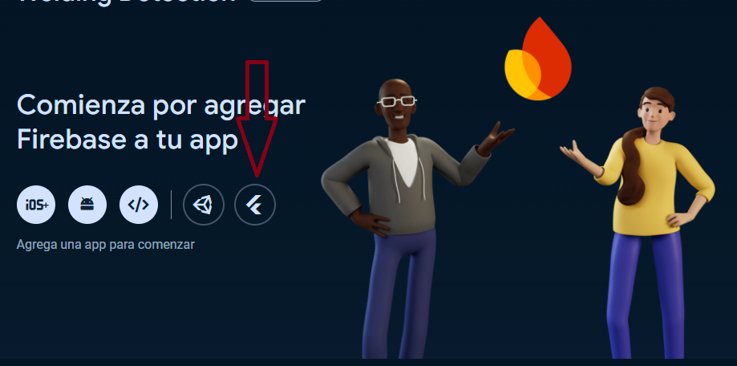


1. _Prepare your workplace_: It will tell us to install requirements. Our Makefile already does everything, so we can skip that step without doing anything.

2. _Install FluterFire CLI_: Likewise, we already automate the installation, so we don't need to run anything. **Only make sure to copy the part that comes after _--project=_ and store it in a text note so we use it later. For example at that step it should give you a code like `flutterfire configure --project=weld-detection`**.

3. _Initialize Firebase_: Again, we automated this part, so no need to run or add code. Accept and go to firebase console.

#### Storage (Firebase)

Images sent by users must be stored in the cloud for their analysis for drift and retraining.
Firebase offers multiple solutions for storing data.
Some are for storing relational data, pair-keys values, fast access, large-size, etc and their names may be confusing. For the storage of images, the most appropriate is Firebase Storage, which is shared with google clouds storage (Firebase is owned by Google).

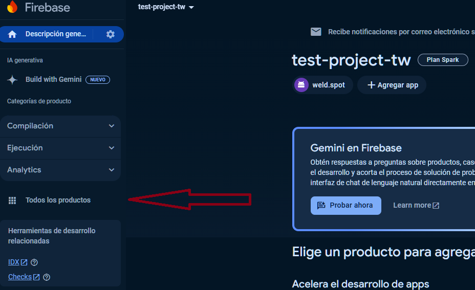

To configure Storage, we select "All products" on the left side menu and pick the one that is called "Storage" below and select start/begin option.

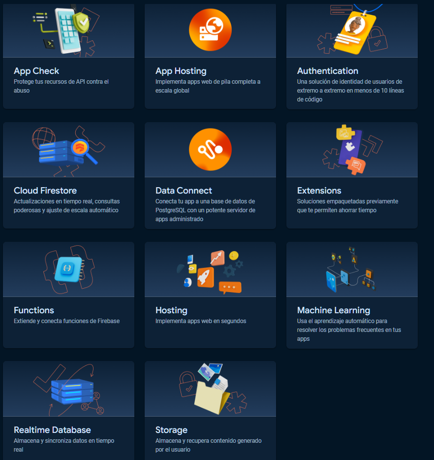

In the Storage configuration, we select development (test, not production) mode for the security rules, and the geographic location that is most close to us if possible. Wait for the bucket to be created.

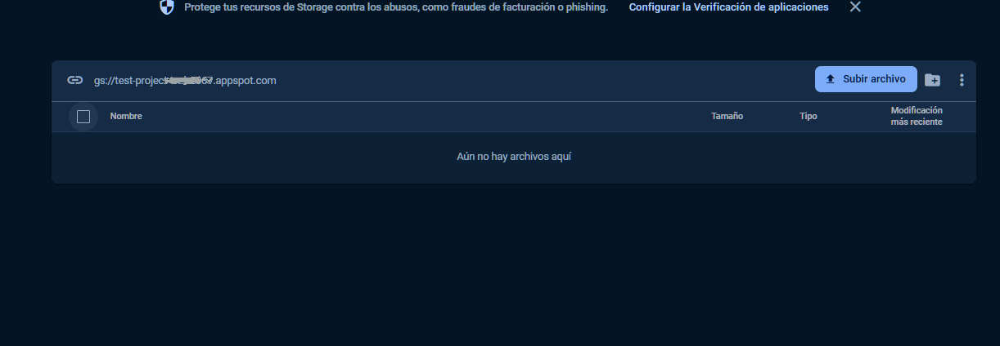

We will now copy the bucket URL, it should look like "gs://project-name-id.appspot.com", **we copy it without the "gs://" and without the ".appspot.com" parts**. (This is our project unique identifier we will use later). So, **copy the code "project-name-id" part and save in a text note for later**.

From this bucket, in case you cannot run the app, you can upload images directly to force retraining and test the drift logic.
More on this topic in the [orchestration section](#Orchestration).

#### Authentication (Firebase)

Because users upload images to the cloud, we require authentication to connect to the service. End-users will be able to send images for the drift analysis and retraining when logged in.

We can set multiple authentications methods (e.g., email, github, google, etc), but the project currently does not implement any.

We start by going to the All products, like before, and select Authentication and start.

We select the native provided "Anonymous" and enable it, so we don't force users to be logged in without any account, only logged as guests (anonymous authentication is not the same as no authentication). (** Note this is just for development purposes, as you would not want unidentified users uploading images**).

#### Firebase ML

Finally, models are also deployed through Firebase, as it offers a way to store the tensorflow lite ML models (used by the flutter app).

Again, we go to **All products**, and select **Machine Learning**. As we implement our own trained model, we are not using Google's Machine Learning services (only the storage). Therefore, we go to the Custom Tab.

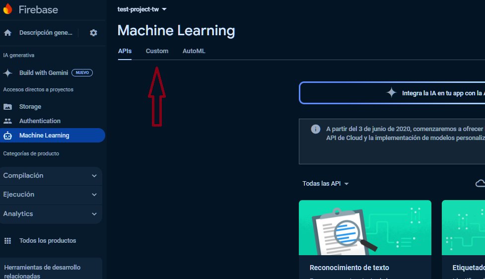

There, we can manually manage our models. But the project already programmed the automatic staging and deployment.

#### Admin download

Although we haven't configured yet some of the products (Authentication and ML), we needed to at least started them (the begin/start button) so that Firebase has assigned those features and does not give any problem when configuring the project.

The access through the devices and from the dataset collection and model deployment services has been programmed. Nonetheless, we need access to the proper firebase credentials for the data collection and modeling service.

On the Firebase Console upper left side, click on the settings wheel and go to project configuration:

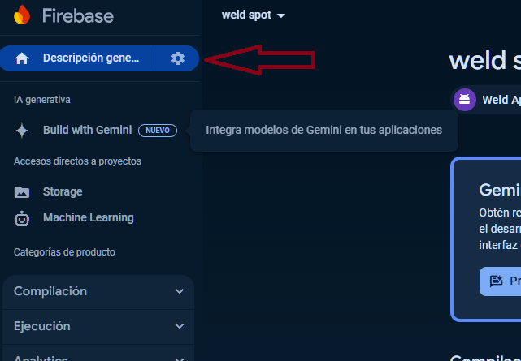

Next we go to the "service accounts" tab, and like in the following image we click on the generate private keys.

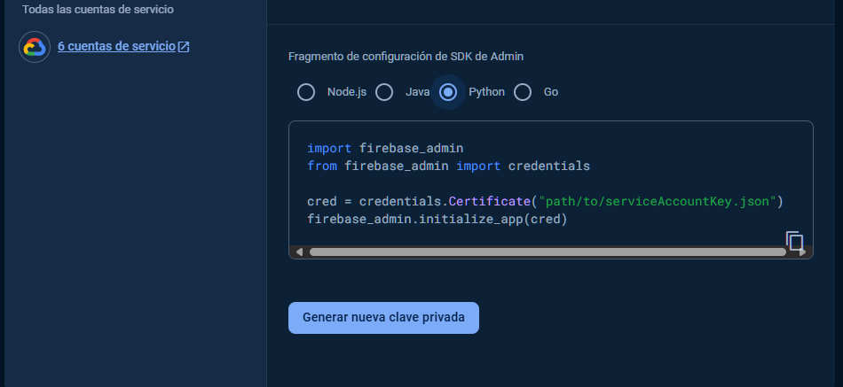

Confirm creating the pair and this will download a file named like "firebase-project-f2109-firebase-adminsdk-68klm-bt5ge88216.json": We rename it only to "serviceAdmin.json" and move it to the project folder, same place where this Readme file is.

** Don't share the file as it contains private info**.

Congrats! The funny part of creating accounts is complete, now the nightmare of setting the project begins :(

## Project setting

1. Clone this repo (`git clone ...`) if you haven't.
2. Create a `.env` file in the project folder (where the README, and serviceAdmin.json files are).
You should add the following variables in the `.env` with the keys you have saved from the cloud steps from before:
```
ROBOFLOW_API_KEY=<your copied key from previous steps>
PREFECT_CLOUD_API_KEY=<your copied key from previous steps>
FIREBASE_PROJECT_NAME=<your copied value from previous steps>
FIREBASE_STORAGE_BUCKET=<your copied name from previous steps>
```
In case you notice the PROJECT_NAME and STORAGE_BUCKET are the same in your scenario. I just make them 2 separate variables because sometimes if you create multiple storage buckets or delete some you may end up with different IDs, so just in case you don't have a clean installation, or Firebase decides to change the default naming in the future or you rename the bucket.

3. Because we have all the configuration code in Makefiles, you may need first to ensure make is installed `sudo apt update && sudo apt install make`.

4. `cd` to the project and call `make setup` to run the Makefile script that sets everyting up. This process may take several minutes as we are configuring everything we need for development + flutter and python requirements. Please be patient, as there are several packages, SDKs, and libraries that have to be installed and time can vary depending on network connection.

If it crashes or you run multiple times the `make setup` it may break some dependencies. In case it fails, it is recommended to go through the individual steps to troubleshot. In a clean installation of the OS should not give problems, so that's why it is advisable to try the project inside a container or WSL. The `make setup` prints a "_[WELDSPOT] SETUP FINISHED SUCCESSFULLY_" message at the end (you can look for the last console message that starts with "[WELDSPOT]" and look through the Makefile to find where it stopped prematurelly). Sometimes this could be caused because of network problems as the script requires to download some packages from Internet.

The Makefile `setup` instruction runs several steps, which you can check by opening the file:
* `dependencies_main`: Ensures python and pre-commit are installed in Linux, for development purposes.
* `dependencies_client`: Ensures packages required by flutter and android development are installed.
* `dependencies_flutter`: Installs flutter and android sdk.
* `dependencies_firebase`: Installes the requirements for Firebase.
* `client/configure`: Inside the client folder, its Makefile configures the flutter project.
* `modeling/configure`: Inside modeling folder, its Makefile installs python requirements and configures firebase and prefect access.

This main Makefile has also rules to call commands from the `modeling/Makefile` and `client/Makefile`, or alternatively you can `cd` to either folder and run their respective Makefile commands. For example, you can run `make model_unit_tests` from the main folder or `make unit_tests` from the modeling folder to run the python tests. You can find more by viewing the Makefiles.

5. After running successfully the `make setup`, there is a final configuration step that requires manual interaction. Run `make client_register`.
    * When asked about _Allow Firebase to collect CLI and Emulator Suite usage and error reporting information? (Y/n)_: Type **N** and press Enter.
    * When asked _To sign in to the Firebase CLI_: Follow its instructions, remember the session ID, visit the URL (in a browser where you are logged in with Firebase Console) and paste in the terminal the code returned. You may need to allow Firebase CLI permissions on your account.
    * When you are presented with _Which platforms should your configuration support_: Ensure at least android has a tick (rest are optional, but the plugin for running the ML model only supports mobile, android and ios).
    * When you're asked _Which Firebase features do you want to set up for this directory_: Use arrows and space to select the following:
        * _Storage: Configure a security rules file for Cloud Storage_. So we can access the cloud storage we've set.
        * _Emulators: Set up local emulators for Firebase products_. Optional, in case we want to develop further the app, so we can test locally.
    * If prompted in _Project Setup_ to _associate this project directory with a Firebase project_. Select **Use an existing project** and select the one you created from the list.
    * When asked _What file should be used for Storage Rules?_ use the default by pressing Enter without typing text.
    * If asked _File storage.rules already exists. Overwrite?_ type **N** and press Enter.
    * When asked about _Which Firebase emulators do you want to set up?_ Select Authentication and Storage and, optionally, accept downloading emulators now.

This process will create a `firebase_options.dart` file inside the `client/lib` folder. It contains the credentials that the `firebase_config.dart` will read to allow users to connect to the cloud to download the models and upload pictures.

**Congratulations on finishing the hardest part**! You may want to take a break. Next steps will be building the projects and running everything.

## Building

The makefiles for `modeling` and `client` folders contain all the scripts for building the services and other utilities like tests and running the firebase emulators. You can check those files in detail, but here are the few instructions we will need.

###### Note: Remember the main `Makefile` at the main folder has prefixes `model_` and `client_` for calling the instructions inside each modeling and client folders. Following script mentions will not use those as they can be called from inside each. For example, instead of running `make model_unit_tests` from the parent project folder, we can `cd ./modeling` and call `make unit_tests`. Whatever is more comfortable.

### Modeling service

Here is a list of the available commands in the makefile and what they do:

* `make quality`: Runs quality checks on python code, including import shorting, linting and code formatting.
* `make unit_tests`: Runs python unit tests with pytest.
* `make integration_test`: Test the services locally to ensure they work correctly.
* `make build_image`: Creates the docker image from the modeling source code so we have it containerized.
* `make export_image`: Exports the docker image to a file so we can deploy it to cloud
* `make run_image`: Runs the image we have built in the local docker machine.
* `make run_app`: Runs the modeling service locally, without containers. For testing purposes.

Note that the docker image is only for running the service part, not the client app neither the cloud services (you can check the Dockerfile). Network and firewall rules should be properly configured in the system (e.g., localstack endpoint) so the deployed container can communicate properly.

### Client app

Here is the list of the available commands in the makefile and what they do:

* `make build_apk`: Builds android installers from the project that can be installed on android devices. This creates multiple files in `client/build/app/outputs/flutter-apk/`, pick the one for your android architecture (usually its armeabi-v7a) to install in your smartphone:
  * app-arm64-v8a-release.apk
  * app-armeabi-v7a-release.apk
  * app-x86_64-release.apk
* `make_build_apk_debug`: If you enabled developer mode in your android device, you can use the apk generated by this instead.
* `make emulate`: Launches the firebase services emulators. Optionally, in case you want to develop further the app.

## Running the service

You can use the `make model_run_app` (locally) or start the docker image we've built.

Besides the `.env` file you've set. You can check the `options.py` of the `modeling` service for configuration like how the images are passed for training.
For example, you can change the batches and epochs trained to ensure the CPU/GPU can load them.

You can use `make model_unit_tests` (from the main Makefile) or `make unit_tests` (from the modeling Makefile) to run the unit tests and check everything works.

Other files you may want to check are the ones in the `flows` folder, that belong to the orchestration based on Prefect 2.
Specially, the file `register_flows.py` schedules the tasks for the two services: Data Collection & Model Training.
They all depend on the code programmed inside the `service` folder, which you can also check to find all the code programmed.

### Orchestration

This section details the Prefect flows created (orchestration pipelines of our services). You can take a look at the code and check the functions called as well.

The pipelines are currently configured to run every day at fixed time. Although we would turn that to weekly so there is enough time to gather more images.
You can change this in the `register_flows.py` so they run sooner and you can check how they do, or you can manually force them to start.

#### Data Collection

Found in `collection_pipeline.py`, in charge of preparing the datased based of the initial source, and images provided continously by the users.

The initial run will download the Roboflow dataset. Additionally it has a flow programmed to every week download new images from Firebase and analyze them to detect drift.

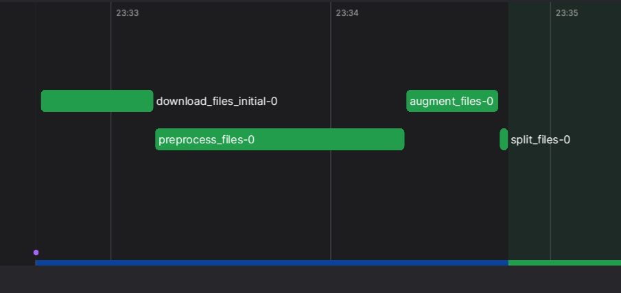

The metric to monitor that I set is AUC. AUC (Area Under the Curve) is a metric to measure how well a model can distinguish between different classes.

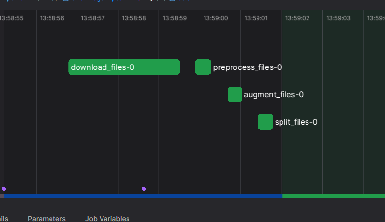

When drift is detected (the AUC goes bellow the threshold configured in options) it will generate the split with the new data so that the training service finds and retrains last model with them.

##### Forcing retraining

The client app uploads the images named as an ID, and the corrected classes by the users with the model detection chance for each class.
In our case, the predicted classes can be: [Background, Bad Welding, Crack, Excess Reinforcement, Good Welding, Porosity, Splatters] in that order, with indexes from 0 to 6 of the model output.
The Mobilenet model employed outputs 7 values, with each being its confidence of every class, so [0.9, 0.5...] would mean 90% it is Background, 50% it is Bad Welding...
Then, in the flutter app, the user can decide if the predictions are correct or correct them (indicating which classes the picture contains).
This results (predictions and corrections) are stored in the file name and sent to firebase for the service to analyze the drift an retrain.

For example `A0Z_1-0.9_0-0.1_0-0.2_0-0.3_0-0.4_0-0.5_0-0.6` means "A0Z" ID (just a random name to avoid duplicates), and each pair of numbers (X-Y.Z) belongs to each weld defect class in order, and mean the following:
  * X = Boolean, 1 = The class exists, 0 = no. Indicated by the users (we currently consider it as truth). For example, the "1-0.9", it means the user indicates background image (no weld), and the next "0-0.1" means the user indicates no "Bad Welding" class.
  * Y.Z = The chance (float, 0 = 0% of the class existing, and 1 = 100% of confidence) of being a class, as predicted by the ML model. For example, in "1-0.9", the prediction is saying 90% of confidence of being a background image, and the user indicates it is. In "0-0.6" the model predicts a 60% confidence of "Splatters" but the image is indicated by the user as not containing any.

So, we can upload a random image with the name "xd_1-0.0_0-1.0_0-1.0_0-1.0_0-1.0_0-1.0_0-1.0.jpg" to the bucket manually, or use the flutter app to contradict a prediction. So, passing that image will say the model is 100% wrong and requires retraining (although more images in a real scenario would be advised to fight bias).
I recommend creating a few, so the system can split them (currently for each image, it generates 8 additional augmented versions, see `options.py` for more info). If no new images are available, the flow will not continue.

#### Model Training

Found in `training_pipeline.py`, in charge of training a new model (not automatic, needs manual trigger but I already ran it and provided the starting weld_0 model) and retraining when there are drifts.


The retraining is scheduled in `register_flows.py` after the data collection, so when new split with drift is detected it retrains the latest model.
Model is stored in the orchestrated container (`models/best` folder) with suffixes for every subsequent version.


After training the model, it is evaluated with both a test split generated from that last new (drifted) data collected, and the initial test split.

If the new model AUC is suficient, it will also be uploaded to the Firebase ML storage so that the client apps download that new version.

Again, model training can be configure in the `options.py`. Additionally, we can also monitorits performance.

##### Experiment Tracking:

For experiment tracking, we've seen MLFlow in the course. Because I already had experience with TensorBoard, the project uses TensorFlow, and TensorFlow has insights for image models (e.g., CNN), I've decided to use TensorBoard.
Tensorflow offers TensorBoard to monitor and view graphics of training performance. The data it generates is stored in the `logs/fit` folder most like MLFlow stores its runs, so that they can be viewed from a browser.

At this point, you managed to build and run the docker service (recommended) or locally (`make model_run_app`). Besides launching the prefect orchestration, it also runs tensorboard (by default on port 6006), so we can access it connecting to the machine URL on port (e.g., http://127.0.0.1:6006/).

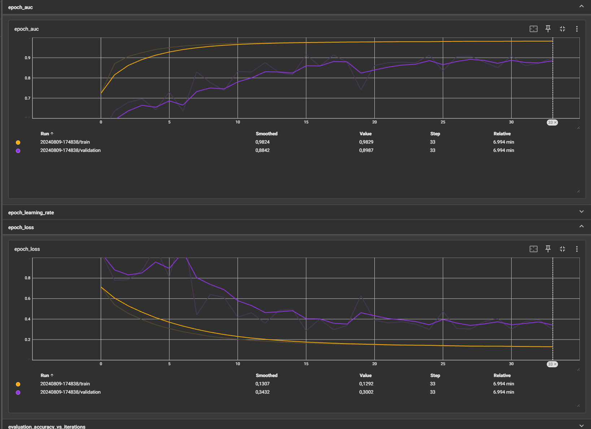

This is an example of our initial training of the "weld_0" model after a few epochs. The runs are stored in subfolders with dates as names, so in the Tensorboard browser UI we can find them and check how well they trained.
This way, combined with the prefect flows telling us if the moel was deployed or not, we can check how was the training and decide to retrain, change parameters or manually deploy a model.

### Flutter app usage

After building the app, and installing it (your device may trigger some warning dialog about installing app outside from android app store or about analyzing the app for security) in your device, you can find the app named "image_classification_mobilenet". The app presents you with a the view of your phone camera (accepting permissions may be required).


The view will show us a panel below with the most probable classes predicted in the image in real-time. It also shows the time frequency of predictions (e.g., FPS, how long it took to pass the image through the model). Performance of predictions may vary depending on smartphone power.

The user can press a capture button, to trigger their feedback by taking a picture from the current camera.
** Beware that using my provided apk and not compiling with your settings will upload the image to MY cloud storage, it's limited like yours so we won't be charged, but you won't see your own Prefect cloud trigger and also don't send me strange pictures, please**.


Here the user can manually tell which classes are showing and which not by checking the boxes. Then the image will be sent to Firebase storage with those corrections.

# Conclusions

With all of this, the project has been described. The script files can be checked for exploring how everything is programmed, but the main organization of the MLOps has been explained.
New concept have also been introduced, more specifically the clouds and technologies employed. So, I hope it all was clear to understand and very beneficial.

The lectures were helpful to visualize each part individually, and have an introduction to each chapter.
This project helped realize the full MLOps architecture and helped me learn how to interconnect each to build a complete solution.
This was a very interesting activity to put to practice the skills from the MLOps course.

As expected from any beginning, some challenges appeared that had to be overcome.
Mostly, errors in developing and building the infrastructure required learning new things, dropping some requirements or finding other tools in order to workaround the problems.
Overall, it was a good experience to prove the concepts and gain new skills.

## Future work

Possible applications and improvements that could be made to this project (either to the MLOps cycle or the app features) include:

* **MLOps**: Improve the models, app interface and orchestration.
* **MLOps**: Organize better the code.
* **MLOps**: Automatize more processes.
* **MLOps**: Monitor more stuff.
* **MLOps**: Improve the pipeline and offer better models.
* **MLOps**: Add grouping for the uploaded images. For instance, the images from multiple users of the same company for training a model specificaly for them.
* **MLOps**: Anonymize images (e.g., blur faces) and ensure data privacy (encryption and authentication).
* **Features**: Automatic detection on production lines.
* **Features**: Assists in expertise audits.
* **Features**: Add detection boxes and segmentation capabilities (detect exact pixels instead of the bounding box).
* **Features**: Proposing solutions or mitigations to bad weldings based on the defects found (could use more AI).
* **Features**: Real-time Augmented Reality (AR) for welding professionals giving support or guiding them while they work.
* **Features**: Support for more types of welding, defects, and related operations.
* **Features**: Forecasting welding quality based on materials, history data and other relevant information.

## Thanks

Special thanks to Alexey Grigorev and the rest of the Zoomcamp team for helping on slack and offering the opportunity to do this course.
