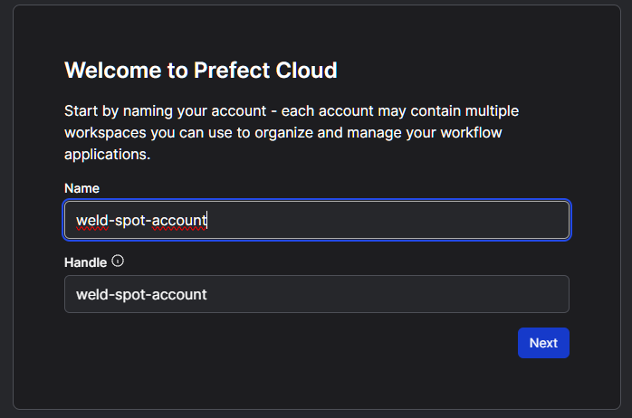

# Weld Spot - Detecting Defects in Welding

Welding consists in joining metal parts together by melting and cooling them. The process involves heat, chemicals and other materials.
The quality of the welding may vary depending on several factors, like the positions, quantity and quality of the materials, pressure, heat, and so on. Defects that welding may result in include cracks, porosity (e.g., air bubbles), tearing, etc.

To ensure adequate quality of the welding, it is important to test the welding (e.g., by applying weight).
Visual inspection is a prior way to detect common defects.
Weldings made by human and machines can be visually checked in search of such defects.
However, when there are a lot of welding points to check in a structure, a human watcher could overlook or misjudge some.

Having an AI-tool to aid during that step can mitigate some of the human errors and prevent failures in the welding to become a major inconvenience.
This project proposes the use of computer vision to automate the visual inspection of weldings, reducing time, costs and failures.

The application of AI requires a lot of components that should communicate well. So, applying MLOps practices will be important for the success of the project.

---

# Table of Contents
- [Objective](#Objective)
- [Structure](#Structure)
  - [Data](#Data)
  - [Modeling](#Modeling)
  - [Cloud](#Cloud)
    - [Containers](#Containers)
  - [Client](#Client)
- [Installation](#Installation)

---

# Objective

The goal of this project is to create a minimum viable product (MVP) that allows clients to check the quality of welding with their smartphone cameras.

The MLOps Lifecycle presented in this repository should be a starting point to achieve this goal.

###### NOTE: There are a lot of types of welding, which include different approaches based on the metals, applications, environments, techniques, and so on. This project only focuses on visual detection in generic welding for basic use cases to make it simple.

# Structure

The following is a diagram that shows how the project is built.
This involves all required parts like client app, data, cloud deployment, etc. This project is centered in MLOps, although DevOps (CI/CD) is also integrated.


This project is divided into three main components: The modeling service, the cloud and the client app.

Following sections overview the technologies employed. You can skip to the [Installation](#Installation) section for instructions on how to configure everything (including the creation of cloud accounts).

The base structure of the project contains the following:

```
WeldSpot/
├─README.md: The document you are reading now. Please, follow the instructions carefully.
├─.pre-commit-config.yaml: The pre-commit hooks.
├─Makefile: The make scripts for settings most of the things in this project.
├─modeling/: The data prepration and model training and deployment. Contents explained later.
├─client/: The client flutter app, explained later.
├─images/: Images used by the readme.
├─.env: File will be created after following instructions. Used to pass environment variables through the scripts.
├─google-services.json: File will be created after following instructions. Settings configured in the cloud.
├─serviceAdmin.json: File will be created after following └─instructions. Admin keys for managing the cloud.
```

## Data
As it can be observed in the illustration, data for model training comes from two sources:

* [Roboflow - Weld Quality Inspection dataset](https://universe.roboflow.com/welding-2bplp/weld-quality-inspection-rei9l/dataset/9) was found, which offers a staring point to train ML models.
* User feedback to measure drift and retrain with their provided images. ** THE IMAGES ARE NOT ANONYMIZED OR CENSORED: INTENDED FOR PRIVATE USE**.

When training the models, data is divided in 3 folders, namely "train" for ML training epochs, "valid" for ML validation epochs, and "test" for testing and evaluation.
Each of these folders, at the same time, contains subfolders for each of the possible classes identified: Background (no welding present), Bad Welding, Crack, Excess Reinforcement, Good Welding, Porosity, and Splatters.

The Weld Quality Inspection dataset does not contain "background" images (which may help improve our model learning performance). So I curated a set of random unrelated images for the initial dataset from public sources (included in the `initial.zip` file).

## Modeling
The two processes that communicate with the cloud deployment are developed inside the `modeling` folder: **Dataset Collection** process and **Model Training** process, with the following structure:

```
modeling/
├──.env: Where required configuration variables are manually set.
├──requirements.txt: Python code dependencies.
├──Makefile: Automation of development processes.
├──Dockerfile: For containerizing the modeling project.
├──options.py: Loads setting variables and files for the python code.
├──app.py: Entry point to execute the modeling service.
├──tests/: Where pytest unit tests are stored.
├──private/: Where private data (e.g., cloud authentication keys) are stored.
├──flows/: Orchestration workflows using prefect.
|  ├──register_flows.py: For registering all the prefect flows with the cloud service.
|  ├──collection_pipeline.py: For the Dataset Collection pipeline.
|  └──training_pipeline.py: For the Model Training pipeline.
├──data/: Where datasets are stored.
|  ├──initial/: Where the initial (Roboflow) dataset is stored.
|  ├──raw:/ Where images corrected by users are stored for future trainings.
|  ├──procesed/: Where the preprocessing tasks stores the images.
|  ├──augmented/: Where augmented images are stored after the preprocess.
|  ├──splits/: Where the final, splitted (train, valid, test) versions are stored for training.
|  └──initial.zip: Background class initial data to use with roboflow dataset.
└──service/: Where the rest of the python code is located (employed by the pipelines mostly).
```

###### NOTE: Some of the paths may be missing and are created when following the [installation instructions](#Installation).

## Cloud

Two cloud services are employed:

* [Firebase](https://firebase.google.com/) from google, is like GCP but more focused to smartphone apps. Offers a _Spark Plan_ with limited free services.
* [Prefect 2](https://docs.prefect.io/latest/) cloud account is free too with enough limited resources for testing the project. We can run the pipeline in a container and monitor it from the cloud.

Instructions on how to create accounts and configure them are provided in the [Installation](#Installation) section.

### Containers

The data collection and model training are built to run on docker container and tested with Ubuntu image.
Because I am using a Windows machine, I installed [Docker Desktop](https://www.docker.com/products/docker-desktop/) and configured it to use [Windows Subsystem for Linux (WSL)](https://learn.microsoft.com/windows/wsl/install). Only installing [Docker](https://docs.docker.com/engine/install/) in your system or deploying to cloud should also work.

Instructions on how to generate the docker image are provided in the [Installation](#Installation) section.

Additionally, if using WSL, for allowing NVIDIA GPU in model training, the Windows machine should have updated [NVIDIA Drivers](https://www.nvidia.com/Download/index.aspx) installed. This is optional if no NVIDIA GPU is available, but will increase the training speed.

## Client
There is an app based in [example of TFLite plugin for flutter](https://github.com/tensorflow/flutter-tflite/tree/main/example/image_classification_mobilenet).
I have already built it for android and include the APK to save some configuration headaches. The project can also be built for iOS, although I haven't tested.

Instructions on how to use and configure the app to work with your Firebase account are provided later.

# Installation

It is recommended to use a clean installation of linux (or WSL, or a docker container), preferably Ubuntu 22.04+,
as the setup script installs several packages, including specific android sdk version.
If conflicts arise, you may check the Makefile `setup` and `dependencies_` scripts for troubleshooting.

## Accounts setting

All of the 3 services we are going to create an account with allow to use google and similar accounts to avoid having to create accounts with mail and password. So you may consider that.

### Roboflow

From Roboflow we only require an API key so they allow us to download datasets from python code.

1. Access [Robofow](https://app.roboflow.com/) and sign-in.
2. Browse to the [Weld quality inspection Dataset](https://universe.roboflow.com/welding-2bplp/weld-quality-inspection-rei9l/dataset/9) we are going to use.
3. In the upper right corner, click on **Download Dataset**, select _Pascal VOC_ format, _show download code_ option and click _Continue_.


4. It will show a snippet with hidden text as in the following image.


5. The rest of the script is already configured in the project, we only need to copy that hidden text by selecting it normally and pasting it. **Copy it to a text note as we will use it later**.

### Prefect

1. Access [Prefect Cloud](https://app.prefect.cloud/) and sign-in.
2. Configure your account if you haven't yet, with a name that hasn't been used by other users.



3. If presented with any _Get Started_ step, we will skip for now by pressing **Next** and **Skip this step**. (We don't create any flow yet).

4. In the upper left side of your prefect dashboard you'll see a "default" option. Click on it, and then in _API Keys_.

5. **Create API Key +**, pick a _Name_ and _Expiration Date_.

6. Copy the key, will look something similar like "pnu_aBBcDeFFgH1J23KKllMMnnnn4OOppp5qqqqR".

7. Similar to the Roboflow key, **copy it to a text note as we will use it later**. Don't lose the key, because it won't be printed again and you'll have to create another.

8. Now, we go back to the prefect dashboard (exit _Settings_).

#### Automation

Here we are going to send an alert when there is drift. So, besides retraining (already programmed in the project), we can receive an email notifying when drift occurs.

1. Click on the **Automation** from the left side of the menu.


2. First, we need the trigger (the event that causes the automation to start). We select **Custom** as the type, and write "drift.detected" as the matching event and "dataset.auc" as the resource. This is the even name I've set in the project code. It may not appear listed in prefect cloud search as you type, but that is not a problem. Configuration should look like following image.


3. Next, as action we pick _Send a notification_. We can leave the default content. Now we click on the **Block** option to fill it.


4. In the **Block** option we have to input the mail (or mails) address that receive the notification alert.


5. We set the email-block with your e-mail as in the picture and confirm.

### Firebase

1. Sign-in into [Firebase Console](https://console.firebase.google.com/u/0/) and create a project with "Start with Firebase Project" option. (We **don't** need credit card information).


2. Project names use a unique identifier (not already taken). Accept terms and proceed.

3. We don't need to use Google Analytics for our project. Create Project and wait for resources to be provided.

#### Features

We now have to setup a series of features so the firebase project works with our project.

##### Android (Firebase)

In the Firebase Console, after selecting the project, we will see a Get Started with your app. We can set iOS if you want to give support to iPhone. But as I can only test with an Android device, I only configure Android.

The default included flutter app project compiles the Android app with package name "weld.spot", so you have to specify this name for use in the already built APK, or generate your own custom Android package name and rebuild the android (flutter) app following later instructions in this readme.

It will give you a Download google-services.json button you must click, and copy the file to the root folder of our project `google-services.json`. We can skip the rest of the steps that say Add Firebase SDK, as that is already automated by this project. Return to Console.

#### Storage (Firebase)

Images sent by users must be stored in the cloud for their analysis for drift and retraining.
Firebase offers multiple solutions for storing data.
Some are for storing relational data, pair-keys values, fast access, large-size, etc. For the storage of images, the most appropriate is Firebase Storage, which is shared with google clouds storage (Firebase is owned by Google).


To configure Storage, we select "All products" on the left side menu and pick the one that is called "Storage" below and select start/begin option.


In the Storage configuration, we select development mode for the security rules, and the geographic location that is most close to us if possible. Wait for the bucket to be created.


We will now copy the bucket URL, it should look like "gs://project-name-id.appspot.com", **we copy it without the "gs://" and without the ".appspot.com" parts**. (This is our project unique identifier we will use later). So, **copy the code "project-name-id" part and save in a text note for later**.

#### Authentication (Firebase)

Because users upload images to the cloud, we require authentication to connect to the service. End-users will be able to send images for the drift analysis and retraining when logged in.

We can set multiple authentications methods (e.g., email, github, google, etc), but the project currently does not implement any.

We start by going to the All products, like before, and select Authentication and start.

We select the native provided "Anonymous" and enable it, so we don't force users to be logged in without any account, only logged as guests (anonymous authentication is not the same as no authentication). (** Note this is just for development purposes, as you would not want unidentified users uploading images**).

#### Firebase ML

Finally, models are also deployed through Firebase, as it offers a way to store the tensorflow lite ML models (used by the flutter app).

Again, we go to **All products**, and select **Machine Learning**. As we implement our own trained model, we are not using Google's Machine Learning services (only the storage). Therefore, we go to the Custom Tab.


There, we can manually manage our models. But the project already programmed the automatic staging and deployment.

#### Admin download

The access through the devices and from the dataset collection and model deployment services has been programmed. Nonetheless, we need access to the proper firebase credentials for the data collection and modeling service.

On the Firebase Console upper left side, click on the settings wheel and go to project configuration:


Next we go to the "service accounts" tab, and like in the following image we click on the generate private keys.


Confirm creating the pair and this will download a file named like "firebase-project-f2109-firebase-adminsdk-68klm-bt5ge88216.json": We rename it only to "serviceAdmin.json" and move it to the project folder, where we moved the google-services.json file too.

** Don't share the file as it contains private info**.

Congrats! The funny part of creating accounts is complete, now the nightmare of setting the project begins :(

## Project setting

1. Clone this repo (`git clone ...`) if you haven't.
2. Create a `.env` file in the project folder (where the README, and serviceAdmin.json files are).
You should add the following variables in the `.env` with the keys you have saved from the cloud steps from before:
```
ROBOFLOW_API_KEY=<your copied key from previous steps>
PREFECT_CLOUD_API_KEY=<your copied key from previous steps>
FIREBASE_STORAGE_BUCKET=<your copied key from previous steps>
```

3. `cd` to the project and call `make setup` to run the Makefile script that sets everyting up. This process make take several minutes are we are configuring everything we need for development + flutter and python requirements.
If it crashes or run multiple times the `make setup` it may break some dependencies. In case it fails, it is recommended to go through the individual steps to troubleshot. (In a clean installation of the OS should not give problems, so that's why it is advisable to try the project inside a container or WSL.

The Makefile setup instruction runs several steps you can check by opening the file:
* `dependencies_main`: Ensures python and pre-commit are installed in Linux, for development purposes.
* `dependencies_client`: Ensures packages required by flutter and android development are installed.
* `dependencies_flutter`: Installs flutter and android sdk.
* `dependencies_firebase`: Installes the requirements for Firebase.
* `client/configure`: Inside the client folder, its Makefile configures the flutter project.
* `modeling/configure`: Inside modeling folder, its Makefile installs python requirements and configures firebase and prefect access.

4. `cd` to the client subfolder and call `firebase login --no-localhost` this requires you to login to your browser firebase account to complete configuration.
5. run `firebase init` after succesfully login. This will allow us to configure its requirements.

Recommended to not override the provided rules.

* Select the features to use: Storage, Emulators.
* Create a new Firebase project to associate the flutter project.
* If error "Cloud resource location is not set", use Firebase Web Interface to set Cloud Storage product: https://console.firebase.google.com/u/0/project/<name-of-project>/storage -> Start
* Configure emulators with the default ports: Authentication and Storage (not Firestore) recommended.


Create configuration file.
```ps
flutterfire configure
```

Activate firebase emulators
```ps
firebase emulators:start
```
Use the "Host:Port" (replace 127.0.0.1 with the IP of the machine running the emulator) for testing the app in your same network.

Use the "View in Emulator UI" URLs in web browser to manually manage the contents. If you open the "Storage" tab in the browser UI of the emulators (127.0.0.1:4000/storage), you can see default bucket URL like "gs://<firebase-project-name>.appspot.com".

Modify file `lib/firebase_config.dart` and use the proper IP and ports on your network. If wanting to deploy to cloud, replace with network addresses provided by Google's Firebase Web Console.

Inside the project there is also firebase.json -> Edit the emulators so they contain `"host": "0.0.0.0"` like this:
```json
{
  "storage": {
    "rules": "storage.rules"
  },
  "emulators": {
    "storage": {
      "port": 9199,
      "host": "0.0.0.0"
    },
    "ui": {
      "enabled": true
    },
    "singleProjectMode": true
  }
}
```
Ensure your machine has the required ports open. Optionally, you could run on Android Emulator instead of a real device.

Remember to remove firewall rules afterwards when not using project emulators.

### Configuring Android build

* Go to Firebase Console.
* Select Project.
* Click on the House icon.
* In the icons select the Android to add to app to start.
* For Android package name use: `org.tensorflow.image_classification_mobilenet`
* Register app.
* Download `google-services.json` file.
* Put the `google-services.json` file in `android/app` folder.
* Skip Steps: Firebase Web Console configuration to enable Firebase SDK with Android (Groovy build.gradle); files are already configured.
* Fill rest of `lib/firebase_config.dart` options according to the `google-services.json`:
```md
apiKey: From client > api_key > current_key.
appId: From client > client_info > mobilesdk_app_id.
messagingSenderId: From project_info > project_number.
projectId: From project_info > project_id.
storageBucket: From project_info > storage_bucket.
```

Rebuild flutter project:
```ps
flutter clean
flutter pub get
```

Fill the values in `android/app/src/main/res/values/values.xml` with the data in `google-services.json` and the ID of your project (default_web_client_id).


5. Create container image for not running locally with `

## Requirements

### Local machine

### Cloud accounts

#### [Firebase](https://firebase.google.com/).


#### [Prefect 2](https://docs.prefect.io/latest/).

# Monitoring:
Evidently, WhyLabs/whylogs, ...
https://blog.tensorflow.org/2020/06/enhance-your-tensorflow-lite-deployment-with-firebase.html

https://firebase.google.com/docs/ml/android/use-custom-models?hl=es-419
https://blog.tensorflow.org/2020/06/enhance-your-tensorflow-lite-deployment-with-firebase.html
